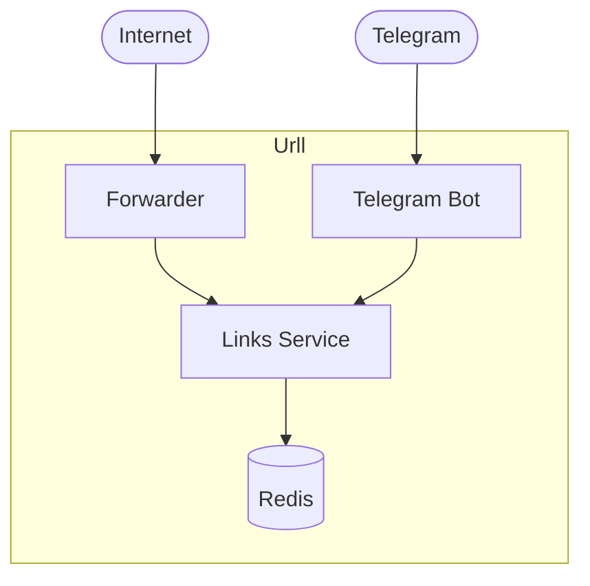

# Urll
Url shortening service

## Architecture

## Telegram bot commands

### /start
Show help

### {url} {code}
Add Link

### /list
List all Links

### /get {code}
Return Link by code

### /delete {code}
Delete Link